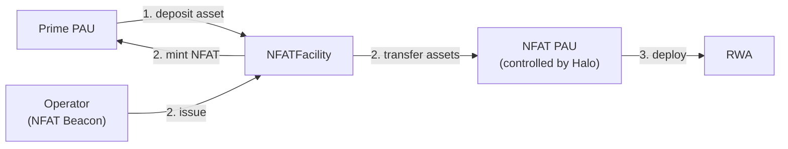
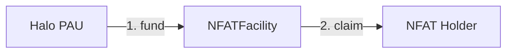
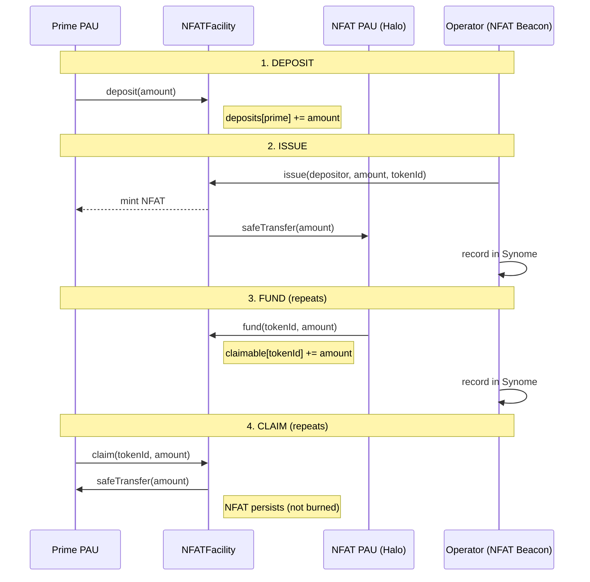

# NFAT Technical Exploration

This document explores the NFAT (Non-Fungible Allocation Token) smart contract implementation. It describes the NFAT draft implementation, documents deliberate deviations from the [Laniakea NFAT specification](https://github.com/sky-ecosystem/laniakea-docs/blob/main/smart-contracts/nfats.md), and tracks open design questions.

---

## Business Requirements

Requirements organized by lifecycle phase.

### 1. Deposit & Queuing

| # | Requirement |
|---|-------------|
| D-1 | A Prime may deposit a designated ERC-20 asset into the facility queue |
| D-2 | A depositor may withdraw any queued balance before issuance |
| D-3 | Only Identity Network members may deposit (when the network is set) |

### 2. Issuance

| # | Requirement |
|---|-------------|
| I-1 | The Operator may issue an NFAT by claiming funds from a depositor's queue and minting an ERC-721 |
| I-2 | Issued funds are transferred to the NFAT PAU (ALMProxy) |
| I-3 | An NFAT may be issued with zero principal (reinvest existing NFAT) |
| I-4 | Token IDs are Operator-assigned; uniqueness enforced (e.g. by ERC-721 `_mint`) |
| I-5 | On-chain metadata records minting timestamp, depositor, and principal |
| I-6 | A single deposit can be split across multiple NFATs with different principals (partial sweeps) |

### 3. Funding & Payments

| # | Requirement |
|---|-------------|
| F-1 | Anyone may fund an existing NFAT with the facility's asset |
| F-2 | Funded amounts accumulate until claimed |
| F-3 | The same fund/claim cycle supports bullet, amortizing, and periodic-interest patterns |
| F-4 | Payment scheduling is managed by the Synome and NFAT Beacon |

### 4. Claims

| # | Requirement |
|---|-------------|
| C-1 | Only the NFAT owner may claim funded amounts |
| C-2 | The caller specifies the claim amount; partial and full claims are both supported |
| C-3 | The NFAT is not burned on claim — it persists for future funding cycles |

### 5. NFAT Transfers

| # | Requirement |
|---|-------------|
| T-1 | NFATs are transferable as standard ERC-721 tokens |
| T-2 | Transfer recipients must be Identity Network members (when set) |

### 6. Identity & Access Control

| # | Requirement |
|---|-------------|
| A-1 | Deposits and transfers are optionally gated by an on-chain Identity Network |
| A-2 | Admin may set or clear the Identity Network at any time |
| A-3 | `DEFAULT_ADMIN_ROLE` (Halo Proxy) manages roles, PAU, identity network, and emergency recovery |
| A-4 | `ROLE_OPERATOR` (NFAT Beacon) issues NFATs |

### 7. Admin & Emergency

| # | Requirement |
|---|-------------|
| E-1 | Admin may recover any ERC-20 token held by the facility |
| E-2 | Admin may update the PAU address |
| E-3 | Granular pause controls - in case of emergencies or to retire a facility |

---

## Architecture Overview

### Issuance



Prime deposits asset in the NFAT Facility. The NFAT Beacon (controlled by Halo GovOps) calls `issue()`, which mints the NFAT to the Prime and transfers the deposited assets to the NFAT's PAU. A single PAU can serve many facilities — the PAU address is configurable per facility and multiple facilities can point to the same one.

### Payment



The Halo sends asset into the NFAT facility over the life of the deal via `fund()`. The NFAT holder calls `claim()` to collect available asset. The NFAT is never burned - funding and claiming can repeat.

---

## Contracts

### NFATFacility

**File:** `src/NFATFacility.sol`

**Inherits:** ERC721, AccessControl, ReentrancyGuard

The core contract. Manages the deposit queue, NFAT issuance, funding (NFAT payments), and claims all in a single contract.

#### State

| Variable | Type | Mutability | Description |
|----------|------|------------|-------------|
| `asset` | `IERC20` | immutable | ERC-20 token accepted for deposits and claims |
| `pau` | `address` | mutable | Payment Account Unit (ALMProxy) - receives funds when NFATs are issued; updatable via `setPau()` |
| `identityNetwork` | `IIdentityNetwork` | mutable | Optional membership gating; `address(0)` disables checks |
| `deposits` | `mapping(address => uint256)` | mutable | Queued deposit balance per depositor |
| `claimable` | `mapping(uint256 => uint256)` | mutable | Funded (claimable) balance per NFAT token ID |
| `nfatData` | `mapping(uint256 => NFATData)` | mutable | On-chain metadata per NFAT |

#### NFATData Struct

```solidity
struct NFATData {
    uint48  mintedAt;    // block.timestamp at issuance
    address depositor;   // original depositor address
    uint256 principal;   // amount claimed from deposit queue at issuance
}
```

#### Roles

| Role | Actor | Purpose | 
|------|-------|---------|
| `DEFAULT_ADMIN_ROLE` | HaloProxy | Role administration, PAU updates, identity network management, emergency recovery. Held by Halo Proxy which can make updates through spells. |
| `ROLE_OPERATOR` | Halo's GovOps/NFAT Beacon | Pulls funds and issues NFATs |

#### Constructor

```solidity
constructor(
    string memory name_,       // facility class name — ERC721 name and symbol become "NFAT-{name_}"
    address admin,             // DEFAULT_ADMIN_ROLE
    address asset_,            // immutable ERC-20
    address pau_,              // initial PAU (ALMProxy)
    address identityNetwork_,  // optional (can be address(0))
    address operator           // ROLE_OPERATOR
)
```

All address parameters except `identityNetwork_` are validated non-zero.

#### Functions

**`deposit(uint256 amount)`**

Queues `asset` (e.g. sUSDS) into the facility. Caller must be a member of the identity network (if set).

| | |
|---|---|
| Access | Any (identity-gated) |
| Guards | `amount > 0`, `_requireMember(msg.sender)` |
| Effects | `deposits[msg.sender] += amount` |
| Interactions | `asset.safeTransferFrom(msg.sender, this, amount)` |
| Event | `Deposited(depositor, amount)` |

**`withdraw(uint256 amount)`**

Withdraws queued funds before issuance. No gating - depositors should always be able to withdraw.

| | |
|---|---|
| Access | Any |
| Guards | `amount > 0`, `deposits[msg.sender] >= amount` |
| Effects | `deposits[msg.sender] -= amount` |
| Interactions | `asset.safeTransfer(msg.sender, amount)` |
| Event | `Withdrawn(depositor, amount)` |

**`issue(address depositor, uint256 amount, uint256 tokenId)`**

Claims funds from a depositor's queue and mints an NFAT. `amount` may be zero to mint an empty NFAT for future funding.

| | |
|---|---|
| Access | `ROLE_OPERATOR` |
| Guards | `depositor != address(0)`, if `amount > 0`: `deposits[depositor] >= amount` |
| Effects | `deposits[depositor] -= amount` (if > 0), `_mint(depositor, tokenId)`, `nfatData[tokenId]` set |
| Interactions | `asset.safeTransfer(pau, amount)` (if > 0) |
| Event | `Issued(depositor, amount, tokenId)` |

**`fund(uint256 tokenId, uint256 amount)`**

Funds an NFAT for the holder to claim. Anyone can call (caller provides tokens).

| | |
|---|---|
| Access | Any |
| Guards | `amount > 0`, token must exist |
| Effects | `claimable[tokenId] += amount` |
| Interactions | `asset.safeTransferFrom(msg.sender, this, amount)` |
| Event | `Funded(tokenId, amount)` |

**`claim(uint256 tokenId, uint256 amount)`**

Claims funded amounts for an NFAT. The caller specifies the amount to claim. The NFAT is **not** burned.

| | |
|---|---|
| Access | NFAT owner only |
| Guards | `ownerOf(tokenId) == msg.sender`, `amount > 0`, `claimable[tokenId] >= amount` |
| Effects | `claimable[tokenId] -= amount` |
| Interactions | `asset.safeTransfer(msg.sender, amount)` |
| Event | `Claimed(tokenId, claimer, amount)` |

**`emergencyWithdraw(address token, address to, uint256 amount)`**

Emergency recovery of any ERC-20 token held by the facility.

| | |
|---|---|
| Access | `DEFAULT_ADMIN_ROLE` |
| Guards | `to != address(0)` |
| Interactions | `IERC20(token).safeTransfer(to, amount)` |
| Event | `EmergencyWithdraw(token, to, amount)` |

**`setPau(address pau_)`**

Updates the PAU address (where funds from NFAT issuance are sent).

| | |
|---|---|
| Access | `DEFAULT_ADMIN_ROLE` |
| Guards | `pau_ != address(0)` |
| Effects | `pau = pau_` |
| Event | `PauUpdated(pau_)` |

**`setIdentityNetwork(address manager)`**

Sets or clears the identity network. Pass `address(0)` to disable.

| | |
|---|---|
| Access | `DEFAULT_ADMIN_ROLE` |
| Effects | `identityNetwork = IIdentityNetwork(manager)` |
| Event | `IdentityNetworkUpdated(manager)` |

#### Internal: Identity Network Enforcement

`_requireMember(address account)` - if `identityNetwork != address(0)`, calls `identityNetwork.isMember(account)` and reverts if false. Called by `deposit()` and the `_update()` ERC-721 override.

`_update(address to, uint256 tokenId, address auth)` — overrides ERC-721. If `to != address(0)` (mint or transfer), enforces identity check. Burns (`to == address(0)`) skip the check.

#### Events

```solidity
event Deposited(address indexed depositor, uint256 amount);
event Withdrawn(address indexed depositor, uint256 amount);
event Issued(address indexed depositor, uint256 amount, uint256 indexed tokenId);
event Funded(uint256 indexed tokenId, uint256 amount);
event Claimed(uint256 indexed tokenId, address indexed claimer, uint256 amount);
event PauUpdated(address indexed pau);
event IdentityNetworkUpdated(address indexed manager);
event EmergencyWithdraw(address indexed token, address indexed to, uint256 amount);
```

## Operational Flow

### Full Lifecycle



Steps 3–4 repeat as the Halo makes payments over the life of the deal.

### Payment Patterns

All patterns use the same `fund()` / `claim()` cycle - the difference is off-chain coordination:

| Pattern | Halo action | Prime action | NFAT state |
|---------|-------------|--------------|------------|
| **Bullet loan** | Fund principal + yield at maturity | Claim once | Persists |
| **Amortizing** | Fund each scheduled payment | Claim after each funding | Persists throughout |
| **Periodic interest** | Fund interest periodically | Claim as available | Persists until final |

Because the NFAT is never burned, the contract does not need to distinguish between these patterns - the Synome and NFAT Beacon handle scheduling.

### Token ID Strategy

Token IDs are provided by the Operator, who coordinates with the Synome to ensure uniqueness. The ERC-721 `_mint` reverts if a `tokenId` already exists, preventing duplicates on-chain.

---

## Identity Network

Deposits and ERC-721 transfers are optionally gated by an Identity Network - an on-chain registry implementing:

```solidity
interface IIdentityNetwork {
    function isMember(address account) external view returns (bool);
}
```

**Note:** The Identity Network is not fully specified yet. However we believe the business logic remains similar even if the interface should change slightly.

**Enforcement points:**
- `deposit()` — caller must be a member
- `_update()` — recipient of mints and transfers must be a member
- Burns are exempt (allows emergency exit regardless of membership)

**Management:**
- `setIdentityNetwork(address)` — callable by `DEFAULT_ADMIN_ROLE`
- Pass `address(0)` to disable all membership checks
- Identity Network is managed externally (e.g., by Halos)

---

## Deviations from Laniakea Spec

This implementation diverges from the [canonical NFAT specification](https://github.com/sky-ecosystem/laniakea-docs/blob/main/smart-contracts/nfats.md) in several deliberate ways.

### 1. NFATs are not burned on redemption

**Spec:** NFAT is burned when the holder redeems (bullet) or "spent" to reduce principal (amortizing).

**Implementation:** The NFAT persists after funds are claimed. Funding and claiming can repeat indefinitely.

**Rationale:** A persistent token naturally supports all payment patterns (bullet, amortizing, periodic interest) without special-casing partial vs. full redemption. Burning risks loss of funds if unclaimed amounts exist. The NFAT serves as a permanent on-chain receipt.

### 2. Single contract instead of Facility + Redeemer

**Spec:** Separate Queue/Facility contract and Redeemer contract per facility.

**Implementation:** `NFATFacility` combines queue, issuance, funding, and claims in a single contract.

**Rationale:** The facility is a transit point, not a long-term custodial store. The simplicity of a single contract outweighs the modularity of splitting. There is no functional reason for funds to flow through a separate redeemer when `fund()` and `claim()` on the same contract achieve the same result.

### 3. Simple deposit accounting instead of shares

**Spec:** Share-based accounting for the deposit queue (ERC-4626 style: `shares = amount * totalShares / totalUnderlying`).

**Implementation:** Direct balance tracking via `deposits[address]`.

**Rationale:** The queue holds a single non-rebasing asset while queued with no yield in the facility itself (the asset itself can be yield-bearing e.g. sUSDS). Shares are always 1:1 with the underlying, making share math unnecessary overhead.

### 4. No role gate on `fund()`

**Spec:** Implies operator/sentinel-controlled funding.

**Implementation:** Anyone can call `fund()`. The function is purely additive — the caller provides tokens via `safeTransferFrom(msg.sender, ...)`.

**Rationale:** Flexibility - enables Halo's to fund a redemption from any PAU. Does not introduce any risks that cannot otherwise be resolved by the Admin or Sky (e.g. a Halo funds the wrong NFAT), as funds are moving into Sky.

## Outstanding Questions

1. **What data should the `NFATData` struct include?** (`NFATFacility.sol:17`)
   Currently stores `mintedAt`, `depositor`, and `principal`. Need to research if more metadata is needed from a business or operational POV.

2. **Should `emergencyWithdraw`'s `to` address be immutable?** (`NFATFacility.sol:132`)
   Setting the recovery destination in the constructor (e.g., to `DsPauseProxy` or similar) would reduce trust assumptions on the admin. Tradeoff: less flexibility in recovery scenarios.
   Currently the Halo Proxy can recover to any address via spell.

3. **Should NFAT facilities be upgradeable?**
   Halo Proxy can update certain parameters - however should they also be able to upgrade the logic of NFAT facilities?
   Argument against: New facilities can be deployed; funds don't need migration since facilities are transit points. With factories and Synome automation, deploying new facilities without painful migration should be possible.

4. **Should all NFAT facilities behave identically or can they differ?**
   In the current Laniakea spec a factory deploys identical `NFATFacility` contracts. Future needs (e.g., specific legal jurisdictions, custom restrictions) may require variants. The interface (`deposit`, `issue`, `fund`, `claim`) should remain stable even if implementations diverge.

5. **Should we support granular pause controls?**
   Not yet implemented in the POC. Could serve as a "retire" mechanism for deprecated facilities. The PAU's rate limits provide some control over outflows, but per-function pausing on the facility would add finer-grained emergency response.