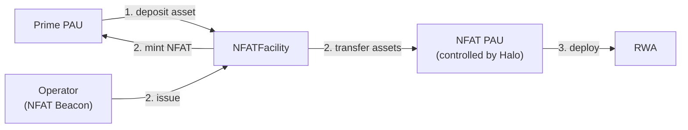
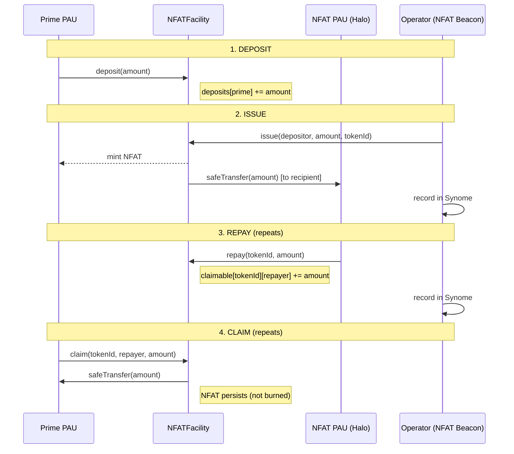

# NFAT Technical Exploration

This document explores the NFAT (Non-Fungible Allocation Token) smart contract implementation. It describes the NFAT draft implementation, documents deliberate deviations from the [Laniakea NFAT specification](https://github.com/sky-ecosystem/laniakea-docs/blob/main/smart-contracts/nfats.md), and tracks open design questions. The Solidity implementation in this repository is a proof of concept intended to demonstrate the business logic.

## Overview

An NFAT (Non-Fungible Allocation Token) is an ERC-721 token that represents a claim on assets within a facility. It is part of the Laniakea ecosystem for real-world asset (RWA) collateral management in the Sky Protocol.

The core contract is the **NFATFacility** - a single Solidity contract that manages the full lifecycle of an NFAT:

1. **Deposit** - Suppliers (Primes) deposits an ERC-20 token (e.g. sUSDS) into the facility's queue.
2. **Issue** - An operator (NFAT Beacon) mints an ERC-721 NFAT to the depositor and transfers the queued funds to a designated recipient (typically a Halo-controlled ALM proxy) for deployment into real-world assets.
3. **Repay** - Over the life of the deal, funds flow back into the facility against specific NFATs (interest, principal repayments, etc.). Repayments are tracked per repayer.
4. **Claim** - The NFAT holder withdraws available funds from a specific repayer's balance at their discretion. The NFAT is never burned - repayment and claiming can repeat indefinitely.
5. **Retract** - A repayer may retract their unclaimed repayments without admin intervention.

### Deposit & Issuance



Prime deposits asset in the NFAT Facility. The NFAT Beacon (controlled by Halo GovOps) calls `issue()`, which mints the NFAT to the Prime and transfers the deposited assets to the recipient (typically the NFAT PAU (ALMProxy)). A single recipient can serve many facilities - the address is configurable per facility and multiple facilities can point to the same one.

### Repay & Claim


The Halo sends asset into the NFAT facility over the life of the deal via `repay()`. The NFAT holder calls `claim()` to collect available asset from a specific repayer's balance. The NFAT is never burned - repayment and claiming can repeat. If a repayer needs to correct a mistake (e.g. wrong NFAT or wrong amount), they can call `retract()` to withdraw unclaimed repayments directly.

This design means the same contract and the same repay/claim cycle support bullet loans, amortizing repayments, and periodic interest payments without any special-casing. Off-chain coordination (via the Synome and NFAT Beacon) determines the schedule; on-chain logic stays simple.

Access is role-gated: a Halo Proxy holds admin rights, and an operator role (the NFAT Beacon) handles issuance. Transfers and claims can optionally be gated by an on-chain Identity Network.

## Operational Flow

### Full Lifecycle



Steps 3–4 repeat as the Halo makes payments over the life of the deal.

### Payment Patterns

All patterns use the same `repay()` / `claim()` cycle - the difference is off-chain coordination:

| Pattern | Halo action | Prime action | NFAT state |
|---------|-------------|--------------|------------|
| **Bullet loan** | Repay principal + yield at maturity | Claim once | Persists |
| **Amortizing** | Repay each scheduled payment | Claim after each repayment | Persists throughout |
| **Periodic interest** | Repay interest periodically | Claim as available | Persists until final |

Because the NFAT is never burned, the contract does not need to distinguish between these patterns - the Synome and NFAT Beacon handle scheduling.

### Token ID Strategy

Token IDs are provided by the Operator, who coordinates with the Synome to ensure uniqueness. The ERC-721 `_mint` reverts if a `tokenId` already exists, preventing duplicates on-chain.

## Business Requirements

Requirements organized by lifecycle phase.

### 1. Deposit & Queuing

| # | Requirement |
|---|-------------|
| D-1 | A Prime may deposit a designated ERC-20 asset into the facility queue |
| D-2 | A depositor may withdraw any queued balance before issuance |
| D-3 | Deposits are open to anyone (no identity gating) |

### 2. Issuance

| # | Requirement |
|---|-------------|
| I-1 | The Operator may issue an NFAT by claiming funds from a depositor's queue and minting an ERC-721 |
| I-2 | Issued funds are transferred to the recipient (NFAT PAU (ALMProxy)) |
| I-3 | An NFAT may be issued with zero principal - e.g. rollover existing NFAT into a new NFAT, with terms detailed in Synome |
| I-4 | Token IDs are Operator-assigned; uniqueness enforced (e.g. by ERC-721 `_mint`) |
| I-5 | A single deposit can be split across multiple NFATs with different principals (partial sweeps) |

### 3. Repayment & Payments

| # | Requirement |
|---|-------------|
| F-1 | Repaid amounts accumulate until claimed |
| F-2 | The same repay/claim cycle supports bullet, amortizing, and periodic-interest patterns |
| F-3 | Payment scheduling is managed by the Synome and NFAT Beacon |

### 4. Claims

| # | Requirement |
|---|-------------|
| C-1 | Only the NFAT owner may claim repaid amounts (identity-gated when Identity Network is set) |
| C-2 | The caller specifies the claim amount - for tax optimization purposes |
| C-3 | The NFAT is not burned on claim - it persists for future repayment cycles |

### 5. NFAT Transfers

| # | Requirement |
|---|-------------|
| T-1 | NFATs are transferable as standard ERC-721 tokens |
| T-2 | Transfer recipients must be Identity Network members (when set) |

### 6. Identity & Access Control

| # | Requirement |
|---|-------------|
| A-1 | Transfers and claims are optionally gated by an on-chain Identity Network |
| A-2 | `DEFAULT_ADMIN_ROLE` (Halo Proxy) manages roles, recipient address, identity network, unpausing, and rescue |
| A-3 | `ROLE_OPERATOR` (NFAT Beacon) issues NFATs |
| A-4 | `ROLE_PAUSE` can freeze the facility — either to retire it or in response to issues. Pauses `deposit`, `issue`, `repay`, `claim`, and `retract` |

### 7. Admin & Emergency

| # | Requirement |
|---|-------------|
| E-1 | Admin may recover any ERC-20 token held by the facility in case of operational failures |
| E-2 | Admin may update the recipient address |
| E-3 | `ROLE_PAUSE` can freeze the facility (pauses `deposit`, `issue`, `repay`, `claim`, `retract`); only admin can unpause |

## Contracts

### NFATFacility

**File:** `src/NFATFacility.sol`

**Inherits:** ERC721, AccessControl, Pausable, ReentrancyGuard

The core contract. Manages the deposit queue, NFAT issuance, repayment (NFAT payments), and claims all in a single contract.

#### State

| Variable | Type | Mutability | Description |
|----------|------|------------|-------------|
| `asset` | `IERC20` | immutable | ERC-20 token accepted for deposits and claims |
| `recipient` | `address` | mutable | Address that receives funds when NFATs are issued (typically the NFAT PAU (ALMProxy)); updatable via `setRecipient()` |
| `identityNetwork` | `IIdentityNetwork` | mutable | Optional membership gating; `address(0)` disables checks |
| `deposits` | `mapping(address => uint256)` | mutable | Queued deposit balance per depositor |
| `claimable` | `mapping(uint256 => mapping(address => uint256))` | mutable | Repaid (claimable) balance per NFAT token ID per repayer |

#### Roles

| Role | Actor | Purpose |
|------|-------|---------|
| `DEFAULT_ADMIN_ROLE` | HaloProxy | Role administration, recipient updates, identity network management, rescue, unpausing. Held by Halo Proxy which can make updates through spells. |
| `ROLE_OPERATOR` | Halo's GovOps/NFAT Beacon | Pulls funds and issues NFATs |
| `ROLE_PAUSE` | Configurable | Freezes the facility - either to retire it or in response to issues. Pauses `deposit`, `issue`, `repay`, `claim`, `retract`. `withdraw` is intentionally exempt so depositors can always exit. Only `DEFAULT_ADMIN_ROLE` can unpause. |

#### Constructor

```solidity
constructor(
    string memory name_,       // ERC721 name and symbol
    address admin,             // DEFAULT_ADMIN_ROLE
    address asset_,            // immutable ERC-20
    address recipient_,        // initial recipient (typically NFAT PAU (ALMProxy))
    address identityNetwork_,  // optional (can be address(0))
    address operator           // ROLE_OPERATOR
)
```

All address parameters except `identityNetwork_` are validated non-zero.

#### Functions

**`deposit(uint256 amount)`**

Queues `asset` (e.g. sUSDS) into the facility.

| | |
|---|---|
| Access | Any, `whenNotPaused` |
| Guards | `amount > 0` |
| Effects | `deposits[msg.sender] += amount` |
| Interactions | `asset.safeTransferFrom(msg.sender, this, amount)` |
| Event | `Deposited(depositor, amount)` |

**`withdraw(uint256 amount)`**

Withdraws queued funds before issuance. No gating - depositors should always be able to withdraw.

| | |
|---|---|
| Access | Any |
| Guards | `amount > 0`, `deposits[msg.sender] >= amount` |
| Effects | `deposits[msg.sender] -= amount` |
| Interactions | `asset.safeTransfer(msg.sender, amount)` |
| Event | `Withdrawn(depositor, amount)` |

**`issue(address depositor, uint256 amount, uint256 tokenId)`**

Claims funds from a depositor's queue and mints an NFAT. `amount` may be zero to mint an empty NFAT for future repayment.

| | |
|---|---|
| Access | `ROLE_OPERATOR`, `whenNotPaused` |
| Guards | `depositor != address(0)`, if `amount > 0`: `deposits[depositor] >= amount` |
| Effects | `deposits[depositor] -= amount` (if > 0), `_mint(depositor, tokenId)` |
| Interactions | `asset.safeTransfer(recipient, amount)` (if > 0) |
| Event | `Issued(depositor, amount, tokenId)` |

**`repay(uint256 tokenId, uint256 amount)`**

Repays an NFAT for the holder to claim. Anyone can call (caller provides tokens).

| | |
|---|---|
| Access | Any, `whenNotPaused` |
| Guards | `amount > 0`, token must exist |
| Effects | `claimable[tokenId][msg.sender] += amount` |
| Interactions | `asset.safeTransferFrom(msg.sender, this, amount)` |
| Event | `Repaid(tokenId, msg.sender, amount)` |

**`claim(uint256 tokenId, address repayer, uint256 amount)`**

Claims repaid amounts for an NFAT from a specific repayer's balance. The caller specifies the repayer and amount to claim. The NFAT is **not** burned.

| | |
|---|---|
| Access | NFAT owner only (identity-gated), `whenNotPaused` |
| Guards | `ownerOf(tokenId) == msg.sender`, `_requireMember(msg.sender)`, `amount > 0`, `claimable[tokenId][repayer] >= amount` |
| Effects | `claimable[tokenId][repayer] -= amount` |
| Interactions | `asset.safeTransfer(msg.sender, amount)` |
| Event | `Claimed(tokenId, claimer, amount)` |

**`retract(uint256 tokenId, uint256 amount)`**

Retracts a repayment. Only the original repayer can retract their unclaimed balance.

| | |
|---|---|
| Access | Any (original repayer), `whenNotPaused` |
| Guards | `amount > 0`, `claimable[tokenId][msg.sender] >= amount` |
| Effects | `claimable[tokenId][msg.sender] -= amount` |
| Interactions | `asset.safeTransfer(msg.sender, amount)` |
| Event | `Retracted(tokenId, repayer, amount)` |

**`rescue(address token, address to, uint256 amount)`**

Rescue any ERC-20 token held by the facility. Does not adjust internal accounting - use `rescueDeposit` or `rescueRepayment` for tracked balances.

| | |
|---|---|
| Access | `DEFAULT_ADMIN_ROLE` |
| Guards | `to != address(0)` |
| Interactions | `IERC20(token).safeTransfer(to, amount)` |
| Event | `Rescued(token, to, amount)` |

**`rescueDeposit(address depositor, address to, uint256 amount)`**

Rescue from a depositor's queued balance with proper accounting.

| | |
|---|---|
| Access | `DEFAULT_ADMIN_ROLE` |
| Guards | `to != address(0)`, `amount > 0`, `deposits[depositor] >= amount` |
| Effects | `deposits[depositor] -= amount` |
| Interactions | `asset.safeTransfer(to, amount)` |
| Event | `RescuedDeposit(depositor, to, amount)` |

**`rescueRepayment(uint256 tokenId, address repayer, address to, uint256 amount)`**

Rescue from a specific repayer's claimable balance with proper accounting.

| | |
|---|---|
| Access | `DEFAULT_ADMIN_ROLE` |
| Guards | `to != address(0)`, `amount > 0`, `claimable[tokenId][repayer] >= amount` |
| Effects | `claimable[tokenId][repayer] -= amount` |
| Interactions | `asset.safeTransfer(to, amount)` |
| Event | `RescuedRepayment(tokenId, repayer, to, amount)` |

**`pause()`**

Freezes the facility. Pauses `deposit`, `issue`, `repay`, `claim`, and `retract`. `withdraw` is intentionally exempt so depositors can always exit. Can be used to retire a facility or in response to issues.

| | |
|---|---|
| Access | `ROLE_PAUSE` |

**`unpause()`**

Resumes facility operations after a pause.

| | |
|---|---|
| Access | `DEFAULT_ADMIN_ROLE` |

**`setRecipient(address recipient_)`**

Updates the recipient address (where funds from NFAT issuance are sent). Typically set to the NFAT PAU (ALMProxy).

| | |
|---|---|
| Access | `DEFAULT_ADMIN_ROLE` |
| Guards | `recipient_ != address(0)` |
| Effects | `recipient = recipient_` |
| Event | `RecipientUpdated(recipient_)` |

**`setIdentityNetwork(address manager)`**

Sets or clears the identity network. Pass `address(0)` to disable.

| | |
|---|---|
| Access | `DEFAULT_ADMIN_ROLE` |
| Effects | `identityNetwork = IIdentityNetwork(manager)` |
| Event | `IdentityNetworkUpdated(manager)` |

#### Internal: Identity Network Enforcement

`_requireMember(address account)` - if `identityNetwork != address(0)`, calls `identityNetwork.isMember(account)` and reverts if false. Called by the `_update()` ERC-721 override.

`_update(address to, uint256 tokenId, address auth)` - overrides ERC-721. If `to != address(0)` (mint or transfer), enforces identity check. Burns (`to == address(0)`) skip the check.

#### Events

```solidity
event FacilityCreated(address indexed asset, address indexed recipient, address indexed admin, address operator);
event Deposited(address indexed depositor, uint256 amount);
event Withdrawn(address indexed depositor, uint256 amount);
event Issued(address indexed depositor, uint256 amount, uint256 indexed tokenId);
event Repaid(uint256 indexed tokenId, address indexed repayer, uint256 amount);
event Claimed(uint256 indexed tokenId, address indexed claimer, uint256 amount);
event Retracted(uint256 indexed tokenId, address indexed repayer, uint256 amount);
event RecipientUpdated(address indexed recipient);
event IdentityNetworkUpdated(address indexed manager);
event Rescued(address indexed token, address indexed to, uint256 amount);
event RescuedDeposit(address indexed depositor, address indexed to, uint256 amount);
event RescuedRepayment(uint256 indexed tokenId, address indexed repayer, address indexed to, uint256 amount);
```

## Identity Network

ERC-721 transfers and claims are optionally gated by an Identity Network - an on-chain registry implementing:

```solidity
interface IIdentityNetwork {
    function isMember(address account) external view returns (bool);
}
```

**Note:** The Identity Network is not fully specified yet. However, we believe the business logic remains similar even if the interface should change slightly.

**Enforcement points:**
- `_update()` - recipient of mints and transfers must be a member
- `claim()` - caller must be a member
- Burns are exempt (allows emergency exit regardless of membership)

**Management:**
- `setIdentityNetwork(address)` - callable by `DEFAULT_ADMIN_ROLE`
- Pass `address(0)` to disable all membership checks
- Identity Network is managed externally (e.g., by Halos)

## Rescue & Pausing

### Pause

The `ROLE_PAUSE` holder can freeze the facility by calling `pause()`. This pauses `deposit`, `issue`, `repay`, `claim`, and `retract`. `withdraw` is intentionally exempt - depositors can always exit. Only `DEFAULT_ADMIN_ROLE` can call `unpause()`.

Use cases:
- **Retire a facility** - pause permanently once all claims are settled
- **Incident response** - freeze operations while investigating an issue

### Rescue

The facility holds two types of tracked balances — `deposits[address]` (queued pre-issuance) and `claimable[tokenId][repayer]` (repaid NFAT balances per repayer) — plus potentially untracked surplus (e.g. tokens sent directly to the contract). Three rescue functions cover the full recovery surface.

#### Rescue with accounting

| Scenario | Function | Accounting |
|----------|----------|------------|
| Need to recover queued deposits on behalf of a depositor | `rescueDeposit()` | Decrements `deposits[depositor]` |
| Need to recover repaid balance from an NFAT (e.g. wrong NFAT or wrong amount) | `rescueRepayment()` | Decrements `claimable[tokenId][repayer]` |

These are admin-only (`DEFAULT_ADMIN_ROLE` / Halo Proxy via spell). They adjust internal accounting so the invariant `asset.balanceOf(facility) >= sum(deposits) + sum(claimable[*][*])` is preserved.

#### Last resort: Generic rescue

| Scenario | Function | Accounting |
|----------|----------|------------|
| Recover any ERC-20 (wrong token sent, untracked surplus) | `rescue()` | None |

The generic `rescue()` does not adjust `deposits` or `claimable`. Using it on the facility's own asset will break the accounting invariant — it exists for cases where no tracked balance corresponds to the tokens being recovered. Prefer the accounting-aware functions above when possible. Note that repayers can also self-service retract their unclaimed repayments via `retract()` without admin intervention.

## Deviations from Laniakea Spec

This implementation diverges from the [canonical NFAT specification](https://github.com/sky-ecosystem/laniakea-docs/blob/main/smart-contracts/nfats.md) in several deliberate ways.

### 1. NFATs are not burned on redemption

**Spec:** NFAT is burned when the holder redeems (bullet) or "spent" to reduce principal (amortizing).

**Implementation:** The NFAT persists after funds are claimed. Repayment and claiming can repeat indefinitely.

**Rationale:** A persistent token naturally supports all payment patterns (bullet, amortizing, periodic interest) without special-casing partial vs. full redemption. Burning risks loss of funds if unclaimed amounts exist. The NFAT serves as a permanent on-chain receipt.

### 2. Single contract instead of Facility + Redeemer

**Spec:** Separate Queue/Facility contract and Redeemer contract per facility.

**Implementation:** `NFATFacility` combines queue, issuance, repayment, and claims in a single contract.

**Rationale:** The facility is a transit point, not a long-term custodial store. The simplicity of a single contract outweighs the modularity of splitting. There is no functional reason for funds to flow through a separate redeemer when `repay()` and `claim()` on the same contract achieve the same result.

### 3. Simple deposit accounting instead of shares

**Spec:** Share-based accounting for the deposit queue (ERC-4626 style: `shares = amount * totalShares / totalUnderlying`).

**Implementation:** Direct balance tracking via `deposits[address]`.

**Rationale:** The contract credits exact transfer amounts without checking received balances, so rebasing and fee-on-transfer tokens are not supported. This is not expected to be an issue as facilities will handle vetted tokens (e.g. sUSDS/USDS). Shares are always 1:1 with the underlying, making share math unnecessary overhead.

### 4. No role gate on `repay()`

**Spec:** Implies operator/sentinel-controlled repayment.

**Implementation:** Anyone can call `repay()`.

**Rationale:** Flexibility - enables Halos to repay from any PAU. Does not introduce any risks that cannot otherwise be resolved by the repayer (via `retract()`), Admin, or Sky (e.g. a Halo repays the wrong NFAT), as funds are moving into Sky.

## Outstanding Questions

### 1. Should `rescue`'s `to` address be immutable?
   Setting the recovery destination in the constructor (e.g., to `DsPauseProxy` or similar) would reduce trust assumptions on the admin. Tradeoff: less flexibility in recovery scenarios.
   Currently the Halo Proxy can recover to any address via spell.

### 2. Should NFAT facilities be upgradeable?
   Halo Proxy can update certain parameters - however should they also be able to upgrade the logic of NFAT facilities?
   Argument against: New facilities can be deployed; funds don't need migration since facilities are transit points. With factories and Synome automation, deploying new facilities without painful migration should be possible.

### 3. Should all NFAT facilities behave identically or can they differ?
   In the current Laniakea spec a factory deploys identical `NFATFacility` contracts. Future needs (e.g., specific legal jurisdictions, custom restrictions) may require variants. The interface (`deposit`, `issue`, `repay`, `claim`) should remain stable even if implementations diverge.

### 4. Should the NFAT facility support granular pause controls on functions?
   In the POC `ROLE_PAUSE` can freeze the facility (`deposit`, `issue`, `repay`, `claim`). `withdraw` is exempt. Only `DEFAULT_ADMIN_ROLE` can unpause.

### 5. ~~Should repayers be able to self-service retract repayment?~~
   **Resolved.** Implemented as `retract()`. The `claimable` mapping is now per-repayer (`claimable[tokenId][repayer]`), and `claim()` takes an explicit `repayer` parameter. Repayers can withdraw unclaimed repayments directly without admin intervention.
