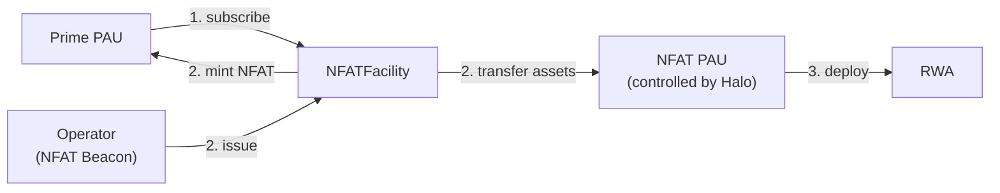
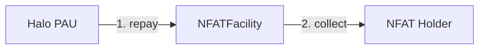
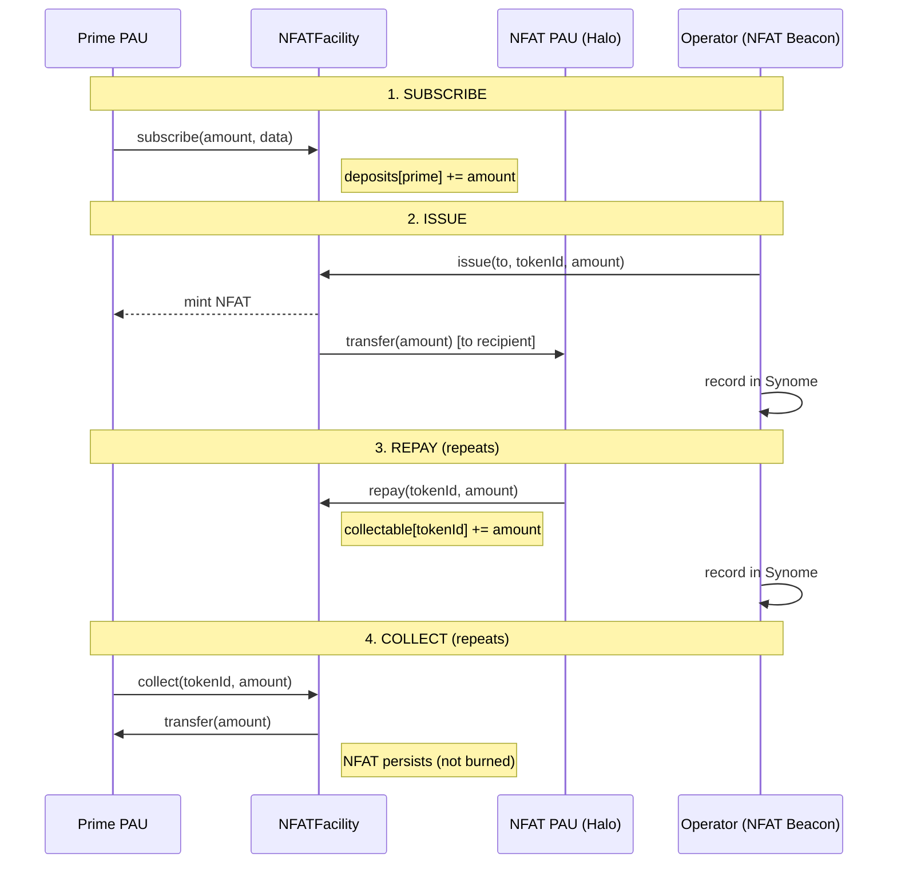

# NFAT Technical Specification

> **Implementation:** [sky-ecosystem/nfat](https://github.com/sky-ecosystem/nfat) (imported as a Foundry lib in this repo). This document describes the production NFATFacility contract and documents deliberate deviations from the [Laniakea NFAT specification](https://github.com/sky-ecosystem/laniakea-docs/blob/main/smart-contracts/nfats.md).

## Overview

An NFAT (Non-Fungible Allocation Token) is an ERC-721 token that represents a claim on assets within a facility. It is part of the Laniakea ecosystem for real-world asset (RWA) collateral management in the Sky Protocol.

The core contract is the **NFATFacility** - a single Solidity contract that manages the full lifecycle of an NFAT:

1. **Subscribe** - Suppliers (Primes) deposit an ERC-20 token (e.g. sUSDS) into the facility's queue, optionally attaching off-chain term metadata.
2. **Issue** - An operator (NFAT Beacon) mints an ERC-721 NFAT to the subscriber and transfers the queued funds to a designated recipient (typically a Halo-controlled ALM proxy) for deployment into real-world assets.
3. **Repay** - Over the life of the deal, funds flow back into the facility against specific NFATs (interest, principal repayments, etc.).
4. **Collect** - The NFAT holder withdraws available funds at their discretion. The NFAT is never burned - repayment and collection can repeat indefinitely.

### Subscribe & Issuance


```mermaid
flowchart LR
    Prime[Prime PAU] -->|1. subscribe| Facility[NFATFacility]
    Beacon["Operator
    (NFAT Beacon)"] -->|2. issue| Facility
    Facility -->|2. mint NFAT| Prime
    Facility -->|2. transfer assets| NFATPAU["NFAT PAU
    (controlled by Halo)"]
    NFATPAU -->|3. deploy| RWA[RWA]
```

Prime subscribes asset to the NFAT Facility. The NFAT Beacon (controlled by Halo GovOps) calls `issue()`, which mints the NFAT to the Prime and transfers the subscribed assets to the recipient (typically the NFAT PAU (ALMProxy)). A single recipient can serve many facilities - the address is configurable per facility via `file()` and multiple facilities can point to the same one.

### Repay & Collect


```mermaid
flowchart LR
    HaloPAU[Halo PAU] -->|1. repay| Facility[NFATFacility]
    Facility -->|2. collect| Holder[NFAT Holder]
```

The Halo sends asset into the NFAT facility over the life of the deal via `repay()`. The NFAT holder calls `collect()` to withdraw available asset. The NFAT is never burned - repayment and collection can repeat.

This design means the same contract and the same repay/collect cycle support bullet loans, amortizing repayments, and periodic interest payments without any special-casing. Off-chain coordination (via the Synome and NFAT Beacon) determines the schedule; on-chain logic stays simple.

Access is role-gated: wards hold admin rights, buds (operators) handle issuance, and cops (freezers) can halt the facility. Transfers and collection can optionally be gated by an on-chain Identity Network.

## Operational Flow

### Full Lifecycle


```mermaid
sequenceDiagram
    participant Prime as Prime PAU
    participant Facility as NFATFacility
    participant NFATPAU as NFAT PAU (Halo)
    participant Beacon as Operator (NFAT Beacon)

    Note over Prime,Beacon: 1. SUBSCRIBE
    Prime->>Facility: subscribe(amount, data)
    Note right of Facility: deposits[prime] += amount

    Note over Prime,Beacon: 2. ISSUE
    Beacon->>Facility: issue(to, tokenId, amount)
    Facility-->>Prime: mint NFAT
    Facility->>NFATPAU: transfer(amount) [to recipient]
    Beacon->>Beacon: record in Synome

    Note over Prime,Beacon: 3. REPAY (repeats)
    NFATPAU->>Facility: repay(tokenId, amount)
    Note right of Facility: collectable[tokenId] += amount
    Beacon->>Beacon: record in Synome

    Note over Prime,Beacon: 4. COLLECT (repeats)
    Prime->>Facility: collect(tokenId, amount)
    Facility->>Prime: transfer(amount)
    Note right of Facility: NFAT persists (not burned)
```

Steps 3–4 repeat as the Halo makes payments over the life of the deal.

### Payment Patterns

All patterns use the same `repay()` / `collect()` cycle - the difference is off-chain coordination:

| Pattern | Halo action | Prime action | NFAT state |
|---------|-------------|--------------|------------|
| **Bullet loan** | Repay principal + yield at maturity | Collect once | Persists |
| **Amortizing** | Repay each scheduled payment | Collect after each repayment | Persists throughout |
| **Periodic interest** | Repay interest periodically | Collect as available | Persists until final |

Because the NFAT is never burned, the contract does not need to distinguish between these patterns - the Synome and NFAT Beacon handle scheduling.

### Token ID Strategy

Token IDs are provided by the Operator, who coordinates with the Synome to ensure uniqueness. Token ID `0` is rejected. The ERC-721 `_mint` reverts if a `tokenId` already exists, preventing duplicates on-chain.

## Business Requirements

Requirements organized by lifecycle phase.

### 1. Subscribe & Queuing

| # | Requirement |
|---|-------------|
| D-1 | A Prime may subscribe a designated ERC-20 asset into the facility queue |
| D-2 | `subscribe()` accepts a `bytes data` parameter for off-chain term metadata |
| D-3 | A subscriber may withdraw any queued balance before issuance |
| D-4 | Subscriptions are open to anyone (no identity gating on subscribe) |

### 2. Issuance

| # | Requirement |
|---|-------------|
| I-1 | The Operator may issue an NFAT by claiming funds from a subscriber's queue and minting an ERC-721 |
| I-2 | Issued funds are transferred to the recipient (NFAT PAU (ALMProxy)) |
| I-3 | An NFAT may be issued with zero principal - e.g. rollover existing NFAT into a new NFAT, with terms detailed in Synome |
| I-4 | Token IDs are Operator-assigned; `tokenId != 0`; uniqueness enforced by ERC-721 `_mint` |
| I-5 | A single subscription can be split across multiple NFATs with different principals (partial sweeps) |

### 3. Repayment & Payments

| # | Requirement |
|---|-------------|
| F-1 | Repaid amounts accumulate until collected |
| F-2 | The same repay/collect cycle supports bullet, amortizing, and periodic-interest patterns |
| F-3 | Payment scheduling is managed by the Synome and NFAT Beacon |

### 4. Collection

| # | Requirement |
|---|-------------|
| C-1 | Only the NFAT owner may collect repaid amounts (identity-gated when Identity Network is set) |
| C-2 | The caller specifies the collect amount - for tax optimization purposes |
| C-3 | The NFAT is not burned on collection - it persists for future repayment cycles |

### 5. NFAT Transfers

| # | Requirement |
|---|-------------|
| T-1 | NFATs are transferable as standard ERC-721 tokens |
| T-2 | Transfer recipients must be Identity Network members (when set) |

### 6. Identity & Access Control

| # | Requirement |
|---|-------------|
| A-1 | Transfers and collection are optionally gated by an on-chain Identity Network |
| A-2 | Wards (admin) manage configuration, roles, rescue, and unfreeze |
| A-3 | Buds (operators) issue NFATs |
| A-4 | Cops (freezers) can halt the facility via `stop()` |

### 7. Admin & Emergency

| # | Requirement |
|---|-------------|
| E-1 | Wards may recover any ERC-20 token held by the facility in case of operational failures |
| E-2 | Wards may update the recipient address via `file()` |
| E-3 | Cops can freeze the facility (stops `subscribe`, `issue`, `repay`, `collect`); only wards can resume via `start()` |

## Contract

### NFATFacility

**Source:** [`sky-ecosystem/nfat`](https://github.com/sky-ecosystem/nfat) (imported via `lib/nfat`)

**Inherits:** ERC721

The core contract. Manages the subscription queue, NFAT issuance, repayment, and collection all in a single contract. Uses MakerDAO-style `wards`/`buds`/`cops` for access control and a `stopped` flag instead of OpenZeppelin's Pausable.

#### State

| Variable | Type | Mutability | Description |
|----------|------|------------|-------------|
| `gem` | `GemLike` | immutable | ERC-20 token accepted for subscriptions, repayments, and collection |
| `recipient` | `address` | mutable | Address that receives funds when NFATs are issued; configurable via `file("recipient", addr)` |
| `identityNetwork` | `IdentityNetworkLike` | mutable | Optional membership gating; `address(0)` disables checks; configurable via `file("identityNetwork", addr)` |
| `baseURI` | `string` | mutable | ERC-721 base URI for token metadata; configurable via `file("baseURI", str)` |
| `stopped` | `bool` | mutable | When `true`, blocks `subscribe`, `issue`, `repay`, `collect` |
| `deposits` | `mapping(address => uint256)` | mutable | Queued subscription balance per subscriber |
| `collectable` | `mapping(uint256 => uint256)` | mutable | Repaid (collectable) balance per NFAT token ID |
| `wards` | `mapping(address => uint256)` | mutable | Admin authorization (1 = authorized) |
| `buds` | `mapping(address => uint256)` | mutable | Operator authorization (1 = authorized) |
| `cops` | `mapping(address => uint256)` | mutable | Freezer authorization (1 = authorized) |

#### Access Control

The contract uses MakerDAO-style authorization patterns instead of OpenZeppelin's AccessControl.

| Role | Mapping | Modifier | Actor | Purpose |
|------|---------|----------|-------|---------|
| Ward | `wards` | `auth` | Halo Proxy | Full admin: configuration, role management, rescue, unfreezing. Deployer is auto-ward. |
| Bud | `buds` | `toll` | NFAT Beacon | Operator: pulls funds and issues NFATs |
| Cop | `cops` | `cop` | Configurable | Freezer: can halt the facility via `stop()` |

**Role management (ward-only):**
- `rely(address)` / `deny(address)` — add/remove wards
- `kiss(address)` / `diss(address)` — add/remove buds (operators)
- `addFreezer(address)` / `removeFreezer(address)` — add/remove cops (freezers)

#### Constructor

```solidity
constructor(
    address gem_,          // immutable ERC-20 token
    string memory name_,   // ERC-721 name
    string memory symbol_  // ERC-721 symbol
)
```

The deployer is automatically set as a ward. No other roles are assigned at construction - the deployer must call `file()`, `kiss()`, and `addFreezer()` to configure the facility.

#### Functions

**`subscribe(uint256 amount, bytes calldata data)`**

Queues `gem` (e.g. sUSDS) into the facility. The `data` parameter is emitted in the event for off-chain term metadata. Zero-amount subscriptions are allowed (emits event with metadata only).

| | |
|---|---|
| Access | Any, `notStopped` |
| Guards | None (zero amount allowed) |
| Effects | If `amount > 0`: `deposits[msg.sender] += amount` |
| Interactions | If `amount > 0`: `gem.transferFrom(msg.sender, this, amount)` |
| Event | `Subscribe(depositor, amount, data)` |

**`withdraw(uint256 amount)`**

Withdraws queued funds before issuance. Not gated by `stopped` - subscribers should always be able to exit.

| | |
|---|---|
| Access | Any |
| Guards | `amount > 0`, `deposits[msg.sender] >= amount` |
| Effects | `deposits[msg.sender] -= amount` |
| Interactions | `gem.transfer(msg.sender, amount)` |
| Event | `Withdraw(depositor, amount)` |

**`issue(address to, uint256 tokenId, uint256 amount)`**

Claims funds from a subscriber's queue and mints an NFAT. `amount` may be zero to mint an empty NFAT for future repayment.

| | |
|---|---|
| Access | Bud (`toll`), `notStopped` |
| Guards | `tokenId != 0`, `deposits[to] >= amount` |
| Effects | `deposits[to] -= amount`, `_mint(to, tokenId)` |
| Interactions | If `amount > 0`: `gem.transfer(recipient, amount)` |
| Event | `Issue(to, tokenId, amount)` |

**`repay(uint256 tokenId, uint256 amount)`**

Repays an NFAT for the holder to collect. Anyone can call (caller provides tokens).

| | |
|---|---|
| Access | Any, `notStopped` |
| Guards | `amount > 0`, token must exist |
| Effects | `collectable[tokenId] += amount` |
| Interactions | `gem.transferFrom(msg.sender, this, amount)` |
| Event | `Repay(sender, tokenId, amount)` |

**`collect(uint256 tokenId, uint256 amount)`**

Collects repaid amounts for an NFAT. The caller specifies the amount. The NFAT is **not** burned.

| | |
|---|---|
| Access | NFAT owner only (identity-gated), `notStopped` |
| Guards | `amount > 0`, `collectable[tokenId] >= amount`, `msg.sender == ownerOf(tokenId)`, identity check |
| Effects | `collectable[tokenId] -= amount` |
| Interactions | `gem.transfer(msg.sender, amount)` |
| Event | `Collect(tokenId, amount)` |

**`file(bytes32 what, address data)`**

Sets configuration parameters. Supported keys: `"recipient"`, `"identityNetwork"`.

| | |
|---|---|
| Access | Ward (`auth`) |
| Event | `File(what, data)` |

**`file(bytes32 what, string calldata data)`**

Sets string configuration. Supported key: `"baseURI"`.

| | |
|---|---|
| Access | Ward (`auth`) |
| Event | `File(what, data)` |

**`rescue(address token, address to, uint256 amount)`**

Rescue any ERC-20 token held by the facility. Does not adjust internal accounting - use `rescueDeposit` or `rescueCollectable` for tracked balances.

| | |
|---|---|
| Access | Ward (`auth`) |
| Interactions | `GemLike(token).transfer(to, amount)` |
| Event | `Rescue(token, to, amount)` |

**`rescueDeposit(address depositor, address to, uint256 amount)`**

Rescue from a subscriber's queued balance with proper accounting.

| | |
|---|---|
| Access | Ward (`auth`) |
| Guards | `deposits[depositor] >= amount` |
| Effects | `deposits[depositor] -= amount` |
| Interactions | `gem.transfer(to, amount)` |
| Event | `RescueDeposit(depositor, to, amount)` |

**`rescueCollectable(uint256 tokenId, address to, uint256 amount)`**

Rescue from an NFAT's collectable balance with proper accounting.

| | |
|---|---|
| Access | Ward (`auth`) |
| Guards | `collectable[tokenId] >= amount` |
| Effects | `collectable[tokenId] -= amount` |
| Interactions | `gem.transfer(to, amount)` |
| Event | `RescueCollectable(tokenId, to, amount)` |

**`stop()`**

Freezes the facility. Stops `subscribe`, `issue`, `repay`, and `collect`. `withdraw` is intentionally exempt so subscribers can always exit.

| | |
|---|---|
| Access | Cop (`cop`) |
| Effects | `stopped = true` |
| Event | `Stop()` |

**`start()`**

Resumes facility operations after a stop.

| | |
|---|---|
| Access | Ward (`auth`) |
| Effects | `stopped = false` |
| Event | `Start()` |

#### Internal: Identity Network Enforcement

`_update(address to, uint256 tokenId, address auth)` - overrides ERC-721. Requires `to` to be an Identity Network member (when set). This gates mints and transfers.

`collect()` - independently checks `identityNetwork.isMember(msg.sender)` before allowing collection.

#### Events

```solidity
// Access control
event Rely(address indexed usr);
event Deny(address indexed usr);
event Kiss(address indexed usr);
event Diss(address indexed usr);
event AddFreezer(address indexed usr);
event RemoveFreezer(address indexed usr);

// Circuit breaker
event Stop();
event Start();

// Configuration
event File(bytes32 indexed what, address data);
event File(bytes32 indexed what, string data);

// Lifecycle
event Subscribe(address indexed depositor, uint256 amount, bytes data);
event Withdraw(address indexed depositor, uint256 amount);
event Issue(address indexed to, uint256 indexed tokenId, uint256 amount);
event Repay(address indexed sender, uint256 indexed tokenId, uint256 amount);
event Collect(uint256 indexed tokenId, uint256 amount);

// Rescue
event Rescue(address indexed token, address indexed to, uint256 amount);
event RescueDeposit(address indexed depositor, address indexed to, uint256 amount);
event RescueCollectable(uint256 indexed tokenId, address indexed to, uint256 amount);
```

## Identity Network

ERC-721 transfers and collection are optionally gated by an Identity Network - an on-chain registry implementing:

```solidity
interface IdentityNetworkLike {
    function isMember(address usr) external view returns (bool);
}
```

**Note:** The Identity Network is not fully specified yet. However, we believe the business logic remains similar even if the interface should change slightly.

**Enforcement points:**
- `_update()` - recipient of mints and transfers must be a member
- `collect()` - caller must be a member
- Burns are exempt (allows emergency exit regardless of membership)

**Management:**
- `file("identityNetwork", address)` - callable by wards
- Pass `address(0)` to disable all membership checks
- Identity Network is managed externally (e.g., by Halos)

## Rescue & Stopping

### Stop

Any cop can freeze the facility by calling `stop()`. This stops `subscribe`, `issue`, `repay`, and `collect`. `withdraw` is intentionally exempt - subscribers can always exit. Only a ward can call `start()`.

Use cases:
- **Retire a facility** - stop permanently once all collections are settled
- **Incident response** - freeze operations while investigating an issue

### Rescue

The facility holds two types of tracked balances — `deposits[address]` (queued pre-issuance) and `collectable[tokenId]` (repaid NFAT balances) — plus potentially untracked surplus (e.g. tokens sent directly to the contract). Three rescue functions cover the full recovery surface.

#### Rescue with accounting

| Scenario | Function | Accounting |
|----------|----------|------------|
| Need to recover queued subscriptions on behalf of a subscriber | `rescueDeposit()` | Decrements `deposits[depositor]` |
| Need to recover repaid balance from an NFAT (e.g. wrong NFAT or wrong amount) | `rescueCollectable()` | Decrements `collectable[tokenId]` |

These are ward-only (Halo Proxy via spell). They adjust internal accounting so the invariant `gem.balanceOf(facility) >= sum(deposits) + sum(collectable)` is preserved.

#### Last resort: Generic rescue

| Scenario | Function | Accounting |
|----------|----------|------------|
| Recover any ERC-20 (wrong token sent, untracked surplus) | `rescue()` | None |

The generic `rescue()` does not adjust `deposits` or `collectable`. Using it on the facility's own gem will break the accounting invariant — it exists for cases where no tracked balance corresponds to the tokens being recovered. Prefer the accounting-aware functions above when possible.

## Deviations from Laniakea Spec

This implementation diverges from the [canonical NFAT specification](https://github.com/sky-ecosystem/laniakea-docs/blob/main/smart-contracts/nfats.md) in several deliberate ways.

### 1. NFATs are not burned on redemption

**Spec:** NFAT is burned when the holder redeems (bullet) or "spent" to reduce principal (amortizing).

**Implementation:** The NFAT persists after funds are collected. Repayment and collection can repeat indefinitely.

**Rationale:** A persistent token naturally supports all payment patterns (bullet, amortizing, periodic interest) without special-casing partial vs. full redemption. Burning risks loss of funds if uncollected amounts exist. The NFAT serves as a permanent on-chain receipt.

### 2. Single contract instead of Facility + Redeemer

**Spec:** Separate Queue/Facility contract and Redeemer contract per facility.

**Implementation:** `NFATFacility` combines queue, issuance, repayment, and collection in a single contract.

**Rationale:** The facility is a transit point, not a long-term custodial store. The simplicity of a single contract outweighs the modularity of splitting. There is no functional reason for funds to flow through a separate redeemer when `repay()` and `collect()` on the same contract achieve the same result.

### 3. Simple deposit accounting instead of shares

**Spec:** Share-based accounting for the deposit queue (ERC-4626 style: `shares = amount * totalShares / totalUnderlying`).

**Implementation:** Direct balance tracking via `deposits[address]`.

**Rationale:** The contract credits exact transfer amounts without checking received balances, so rebasing and fee-on-transfer tokens are not supported. This is not expected to be an issue as facilities will handle vetted tokens (e.g. sUSDS/USDS). Shares are always 1:1 with the underlying, making share math unnecessary overhead.

### 4. No role gate on `repay()`

**Spec:** Implies operator/sentinel-controlled repayment.

**Implementation:** Anyone can call `repay()`.

**Rationale:** Flexibility - enables Halos to repay from any PAU. Does not introduce any risks that cannot otherwise be resolved by the Admin or Sky (e.g. a Halo repays the wrong NFAT), as funds are moving into Sky.

## Outstanding Questions

### 1. Should `rescue`'s `to` address be immutable?
   Setting the recovery destination in the constructor (e.g., to `DsPauseProxy` or similar) would reduce trust assumptions on the admin. Tradeoff: less flexibility in recovery scenarios.
   Currently the Halo Proxy can recover to any address via spell.

### 2. Should NFAT facilities be upgradeable?
   Halo Proxy can update certain parameters - however should they also be able to upgrade the logic of NFAT facilities?
   Argument against: New facilities can be deployed; funds don't need migration since facilities are transit points. With factories and Synome automation, deploying new facilities without painful migration should be possible.

### 3. Should all NFAT facilities behave identically or can they differ?
   In the current Laniakea spec a factory deploys identical `NFATFacility` contracts. Future needs (e.g., specific legal jurisdictions, custom restrictions) may require variants. The interface (`subscribe`, `issue`, `repay`, `collect`) should remain stable even if implementations diverge.

### 4. Should the NFAT facility support granular stop controls on functions?
   Currently cops can freeze the entire facility (`subscribe`, `issue`, `repay`, `collect`). `withdraw` is exempt. Only wards can resume via `start()`.

### 5. Should repayers be able to self-service retract repayment?
   Currently, retracting repaid amounts requires admin intervention via `rescueCollectable()`, which means a spell is needed to correct any repayment mistake. An alternative is a self-service retract function that lets the original repayer reclaim their contribution directly. This would require per-repayer accounting (`collectable[tokenId][repayer]` instead of flat `collectable[tokenId]`), which in turn means `collect()` must specify which repayer to draw from. The tradeoff: self-service retract avoids the spell overhead for operational corrections (e.g. Halo repays wrong NFAT or wrong amount), but adds complexity to the collect flow and mapping structure.
